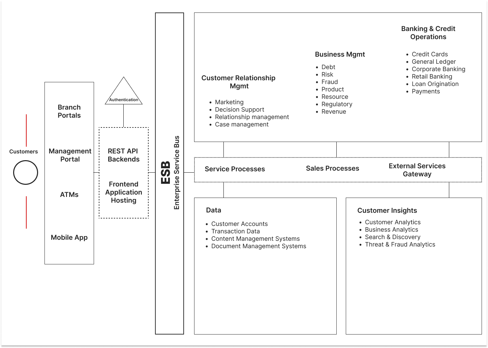

# Tripher Banking System
A comprehensive guide to building a fictional bank's technology architecture from the ground up. This repository covers everything from barebones hardware setup to the final deployment of a secure, client-facing mobile app. Includes infrastructure planning, backend API development, database design, and security protocols. by Tinaishe Kadango

  
  
  
  
  
  
  
  
  
  
  
  

 

 

## Client Web Application

**Technologies Used:** Ionic React, modular architecture, RESTful API, JWT (JSON Web Token), TLS encryption, component-based structure.

This web application, developed with **Ionic React**, leverages a modular architecture to deliver a responsive and cross-platform banking solution. It integrates with backend services through **RESTful API endpoints**, enabling functionalities such as account management, transaction retrieval, secure fund transfers, and bill payments. The app employs **JWT-based authentication** for session management and **TLS encryption** to ensure secure data transmission. With its component-based structure and adherence to best practices, the app is designed for scalability, maintainability, and optimal performance across web and mobile platforms.

 

## C# REST API

**Technologies Used:** ASP.NET Core, Entity Framework Core, Npgsql, C#, JWT Authentication, pgAdmin/DBeaver, Docker, Visual Studio, NuGet, Azure/AWS/Heroku, GitHub.

**End Points:** /Users

**File Structure:** 

	Tripher Inc/
	|
	|
	|-- Controllers/ (API Controllers)  
	|-- Data/ (Database context and migrations)  
	|-- Models/ (Entity models)  
	|-- DTOs/ (Data Transfer Objects)  
	|-- Repositories/ (Repository interfaces and implementations)  
	|-- Services/ (Business logic)  
	|-- Middleware/ (Custom middleware)  
	|-- Helpers/ (Utility classes or helpers)  
	|-- Program.cs (Application entry point)  
	|-- Startup.cs (Application configuration)  
	|-- appsettings.json (Configuration file)  

The **C# REST API** is designed for a fictional banking system, built using the **ASP.NET Core framework** and following a **microservices architecture**. The system is modular, with each microservice dedicated to a specific domain such as **Account Management**, **Transaction Processing**, **User Authentication**, and **Reporting**. These services communicate through lightweight **HTTP RESTful APIs** and **message queues** for asynchronous communication, ensuring scalability, fault tolerance, and ease of maintenance. Each microservice is containerized using **Docker**, allowing for seamless deployment and orchestration with tools like **Kubernetes**. The API includes robust security features such as **JWT-based authentication**, **role-based access control (RBAC)**, and **data encryption** to ensure the safety of sensitive banking information. 

 

## Hardware

Tripher systems require a server-grade machine with at least a **quad-core processor (e.g., Intel Xeon or AMD Ryzen 5)**, **16 GB of RAM**, and **500 GB of SSD storage** to ensure fast data access and processing. The system should have **a stable network connection (1 Gbps recommended)** to handle API requests efficiently. A **64-bit operating system** like Windows Server 2019 or a Linux distribution such as Ubuntu 22.04 is required, with Docker and Docker Compose pre-installed. Additionally, the PostgreSQL database will require optimized disk I/O, and the React frontend can be hosted on the same server or a dedicated Node.js environment for scalability. 

**Server Requirements:**

	|-- Processor: Quad-core CPU (e.g., Intel Xeon or AMD Ryzen 5)
	|-- Memory: 16 GB RAM
	|-- Storage: 500 GB SSD
	|-- Network: 1 Gbps stable connection
	|-- Operating System: 64-bit Windows Server 2019 or Linux (e.g., Ubuntu 22.04)
	|-- Software: Docker, Docker Compose, PostgreSQL, Node.js